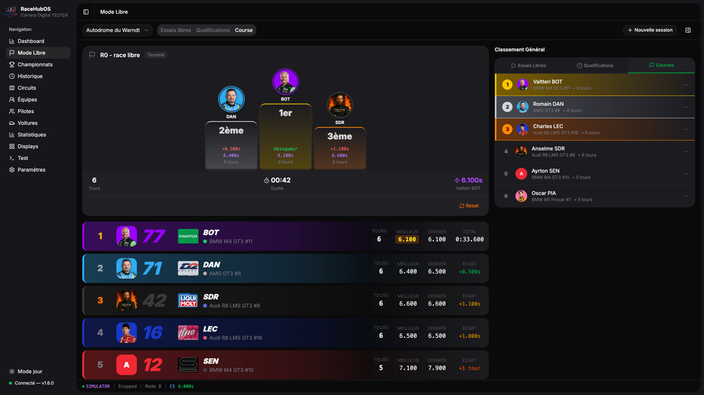
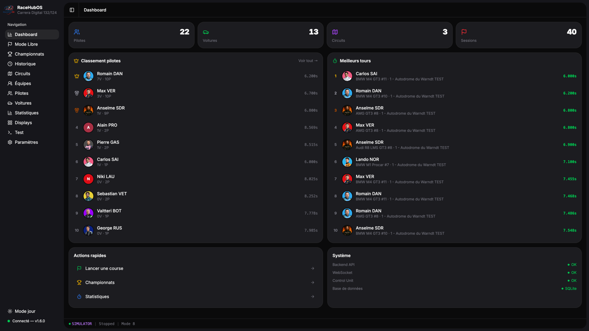
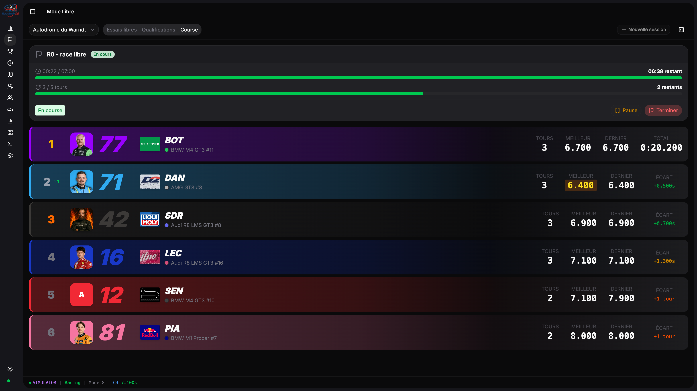
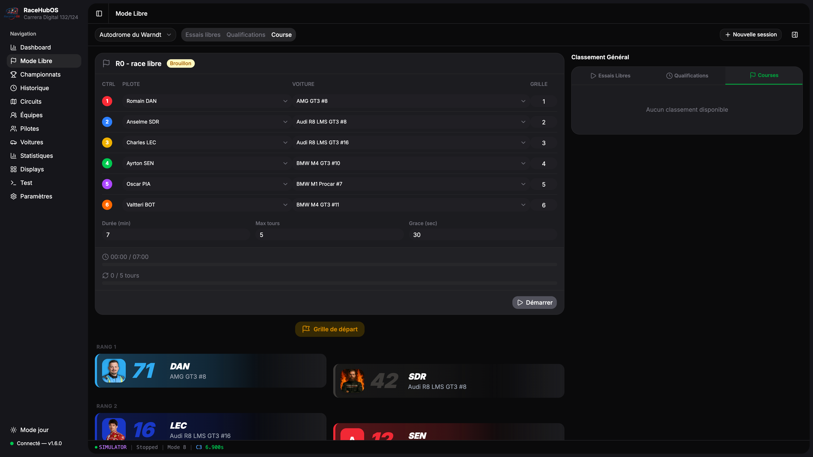
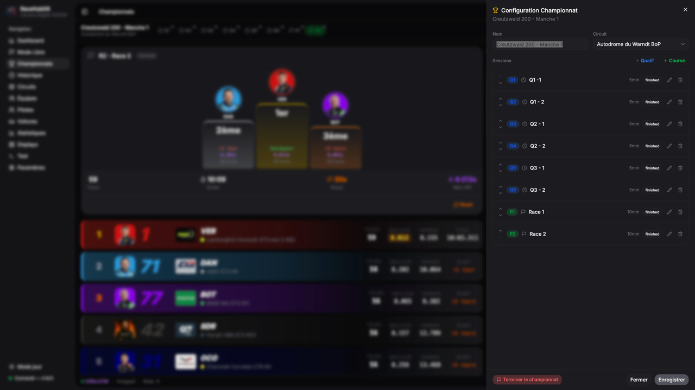
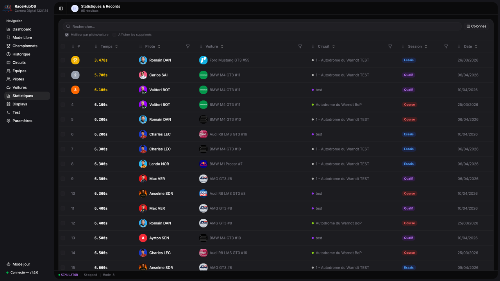
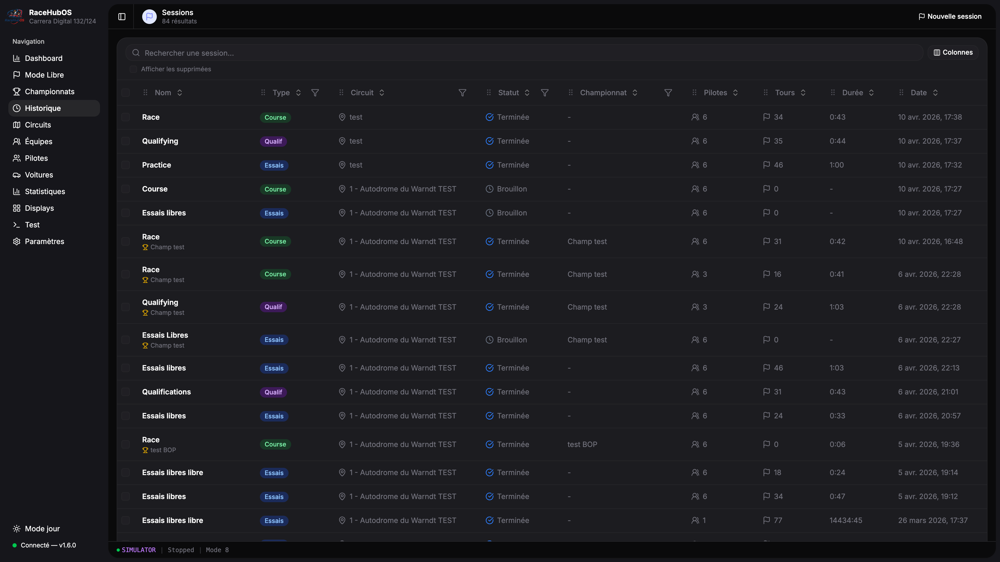
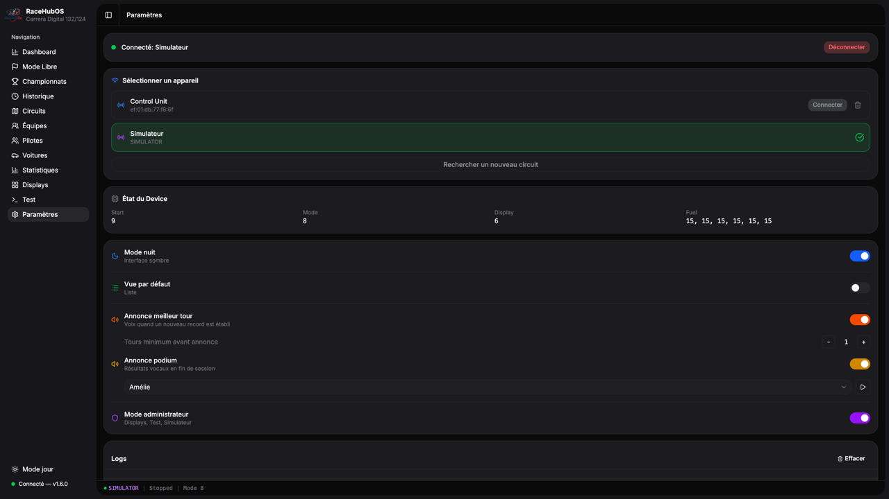

# 🏁 RaceHubOS

**Free & open source race management for Carrera Digital 132/124**



Carrera dropped their official app. Existing alternatives are closed source. We believe slot racing deserves an open, community-driven tool that anyone can use, improve, and adapt to their setup.

RaceHubOS is a full-featured race management system that runs in your browser. Plug your Carrera Control Unit, open a browser, and race.

Built by slot racers, for slot racers. 🏎️

**[English](#-features)** | **[Français](#-version-française)**

---

## Table of Contents

- [Features](#-features)
- [Tech Stack](#️-tech-stack)
- [Getting Started](#-getting-started)
  - [Prerequisites](#prerequisites)
  - [macOS / Linux](#-macos---linux)
  - [Windows](#-windows)
  - [Upgrade](#-upgrade)
- [Development](#-development)
  - [Simulator](#-simulator)
  - [WebSocket Events](#-websocket-events)
- [Contributing](#-contributing)
- [License](#-license)
- [Credits](#-credits)
- [Version française](#-version-française)

---

## ✨ Features

- 📊 Real-time race leaderboard with animated positions
- 👤 Driver, car, track and team management with photos
- 🏆 Championship system with multi-session support (Practice, Qualifying, Race)
- 📈 Standings and statistics per championship and session type
- ⚙️ Inline session configuration (controllers, duration, laps, grace period)
- 🥇 Podium display at end of session with gaps and best lap
- 🗣️ Voice announcements (best lap, podium results) via Web Speech API
- 🎙️ Configurable voice settings (voice selection, min laps threshold)
- 🚦 Start lights sequence with audio cues
- 🌙 Dark mode (Zinc palette)
- 🔌 Bluetooth LE connectivity to Carrera Control Unit via AppConnect
- 🎮 Built-in simulator for development (no hardware required)
- 🏎️ Free session mode with persistent track/type selection
- 📺 Driver displays for external screens

## 🛠️ Tech Stack

**Frontend:**
- React 19 + JavaScript (ES6+)
- Vite
- TailwindCSS + shadcn/ui
- Socket.io-client
- Framer Motion

**Backend:**
- Node.js 20+ + JavaScript (ES6+ modules)
- Express + Socket.io
- Prisma + SQLite (WAL mode)
- Built-in race simulator

## 🚀 Getting Started

### Prerequisites

- Node.js 20+
- npm 10+
- Git

> **Note:** The app currently runs in **development mode** (`npm run dev`) on all platforms. The Express backend does not yet serve the built frontend — the Vite dev server is required. Standalone packaged builds (`.exe`, `.app`, `.AppImage`) are planned for the future.

### 🍎 macOS / 🐧 Linux

```bash
# Clone the repo
git clone https://github.com/AnselmeSDR/RaceHubOS.git
cd RaceHubOS

# Install dependencies
npm install

# Initialize the database
cd packages/backend
npx prisma generate
npx prisma db push
cd ../..

# Start the app (frontend + backend)
npm run dev
```

The frontend will be available at http://localhost:5173 and the backend API at http://localhost:3001.

### 🪟 Windows

#### First install

1. Download `RaceHubOS-upgrade.bat` from the repo
2. Place it on the Desktop
3. Double-click to run

The script handles everything:
- Clones the repo into `C:\Users\<user>\RaceHubOS-v<version>`
- Installs dependencies (`npm install`)
- Generates the Prisma client and applies migrations
- Creates a launcher `RaceHubOS-v<version>.bat` (runs `npm run dev` + opens the browser)
- Creates a Desktop shortcut with the icon

#### Usage

Double-click the **RaceHubOS** shortcut on the Desktop. The browser opens automatically after a few seconds.

### 🔄 Upgrade

1. Double-click `RaceHubOS-upgrade.bat` on the Desktop
2. The script auto-detects the latest installed version (semver sort)
3. Clones the new version, copies the database and uploads
4. Creates a new launcher and shortcut
5. Displays the changelog at the end
6. Previous versions are kept (rollback possible)

## 🧑‍💻 Development

### 🎮 Simulator

The built-in simulator mimics the Carrera Control Unit. No hardware required.

1. Open Settings
2. Connect to "Simulator"
3. Configure a session and start

### 🔌 WebSocket Events

Key events emitted by the backend:
- `session:leaderboard` — Real-time leaderboard updates
- `session:heartbeat` — Timing, remaining time/laps, leaderboard sync
- `session:bestlap` — New session best lap (triggers voice announcement)
- `session:finished` — Session end with final leaderboard
- `session:status_changed` — Session lifecycle transitions
- `cu:status` — Control Unit status (lights, mode, fuel)
- `cu:timer` — Raw lap/sector times from hardware

## 🤝 Contributing

RaceHubOS is an active project with a lot of room to grow. Here are some directions we'd love help with:

- 🍓 **Raspberry Pi** — Run the app on a dedicated Pi for a permanent race station
- 📱 **Tablet control** — Touch-friendly interface for race direction from a tablet
- 📺 **External displays** — Dedicated screens for spectators (leaderboard, live timing, standings)
- 🏗️ **Packaged builds** — Standalone `.exe`, `.app`, `.AppImage`
- 🧩 **New features** — Penalties, fuel strategy, team relay races, lap charts, and more
- **Ideas & bugs** — [Open an issue](https://github.com/AnselmeSDR/RaceHubOS/issues)
- **Code** — Fork, branch, and submit a pull request
- **Questions** — Reach out at anselme8@icloud.com

All contributions are welcome — whether it's a feature, a bug fix, a design idea, or just feedback.

## 📄 License

Apache-2.0

## 🙏 Credits

**Project**
- Anselme Schneider — Founder & Developer (anselme8@icloud.com)
- Romain Danna — Co-author (domain & race expertise)

**Libraries & References**
- Protocol reverse engineering: Stephan Hess (slotbaer.de)
- carreralib: Thomas Kemmer
- OpenLap: Thomas Kemmer

Vibe coded with [Claude Code](https://claude.ai/code)

---

## 🇫🇷 Version française

Carrera a abandonné son app officielle. Les alternatives existantes sont fermées. On pense que le slot racing mérite un outil ouvert et communautaire que chacun peut utiliser, améliorer et adapter à son installation.

RaceHubOS est un système complet de gestion de course qui tourne dans le navigateur. Branchez votre Control Unit Carrera, ouvrez un navigateur, et roulez.

Fait par des passionnés de slot, pour des passionnés de slot. 🏎️

### Fonctionnalités

- 📊 Classement en temps réel avec animations de positions
- 👤 Gestion des pilotes, voitures, circuits et équipes avec photos
- 🏆 Système de championnat multi-sessions (Essais libres, Qualifications, Course)
- 📈 Classements et statistiques par championnat et type de session
- ⚙️ Configuration de session inline (contrôleurs, durée, tours, période de grâce)
- 🥇 Podium en fin de session avec écarts et meilleur tour
- 🗣️ Annonces vocales (meilleur tour, résultats podium) via Web Speech API
- 🎙️ Réglages voix configurables (choix de la voix, seuil de tours minimum)
- 🚦 Séquence de feux de départ avec sons
- 🌙 Mode sombre (palette Zinc)
- 🔌 Connexion Bluetooth LE à la Control Unit Carrera via AppConnect
- 🎮 Simulateur intégré pour le développement (pas de matériel requis)
- 🏎️ Mode session libre avec mémorisation du circuit et du type
- 📺 Affichages pilotes pour écrans externes

### Installation

#### macOS / Linux

```bash
git clone https://github.com/AnselmeSDR/RaceHubOS.git
cd RaceHubOS
npm install
cd packages/backend && npx prisma generate && npx prisma db push && cd ../..
npm run dev
```

Le frontend est accessible sur http://localhost:5173 et l'API backend sur http://localhost:3001.

#### Windows

1. Télécharger `RaceHubOS-upgrade.bat` depuis le dépôt
2. Le placer sur le Bureau
3. Double-cliquer pour lancer

Le script gère tout automatiquement : clone, installation, base de données, lanceur et raccourci Bureau.

Pour mettre à jour, relancer le même `.bat` — il détecte la version installée, clone la nouvelle, copie les données et crée un nouveau raccourci. Les anciennes versions sont conservées.

> **Note :** L'application tourne actuellement en mode développement (`npm run dev`). Des builds packagés (`.exe`, `.app`, `.AppImage`) sont prévus à terme.

### Stack technique

**Frontend :** React 19, Vite, TailwindCSS + shadcn/ui, Socket.io-client, Framer Motion

**Backend :** Node.js 20+, Express + Socket.io, Prisma + SQLite (WAL), Simulateur intégré

### Développement

#### Simulateur

Le simulateur intégré reproduit le comportement de la Control Unit Carrera. Aucun matériel requis.

1. Ouvrir les Paramètres
2. Se connecter au "Simulateur"
3. Configurer une session et démarrer

#### Événements WebSocket

Événements principaux émis par le backend :
- `session:leaderboard` — Classement en temps réel
- `session:heartbeat` — Timing, temps/tours restants, sync leaderboard
- `session:bestlap` — Nouveau meilleur tour de session (déclenche l'annonce vocale)
- `session:finished` — Fin de session avec classement final
- `session:status_changed` — Transitions du cycle de vie de la session
- `cu:status` — État de la Control Unit (feux, mode, carburant)
- `cu:timer` — Temps bruts tours/secteurs depuis le matériel

### Contribuer

Le projet est en développement actif et ouvert aux contributions :

- 🍓 **Raspberry Pi** — Faire tourner l'app sur un Pi dédié
- 📱 **Contrôle tablette** — Interface tactile pour la direction de course
- 📺 **Écrans externes** — Affichages dédiés pour les spectateurs
- 🏗️ **Builds packagés** — Exécutables standalone
- 🧩 **Nouvelles features** — Pénalités, stratégie carburant, relais par équipe, graphiques de tours, etc.
- **Idées et bugs** — [Ouvrir une issue](https://github.com/AnselmeSDR/RaceHubOS/issues)
- **Code** — Fork, branche, et pull request
- **Questions** — anselme8@icloud.com

### Licence

Apache-2.0

### Crédits

**Projet**
- Anselme Schneider — Fondateur & Développeur (anselme8@icloud.com)
- Romain Danna — Co-auteur (expertise course & métier)

**Librairies & Références**
- Reverse engineering du protocole : Stephan Hess (slotbaer.de)
- carreralib : Thomas Kemmer
- OpenLap : Thomas Kemmer

Vibe codé avec [Claude Code](https://claude.ai/code)

---

## 📸 Screenshots

| | |
|---|---|
|  **Dashboard** |  **Race** |
|  **Free Session** |  **Championships** |
|  **Drivers** |  **Statistics** |
|  **Sessions** |  **Settings** |
